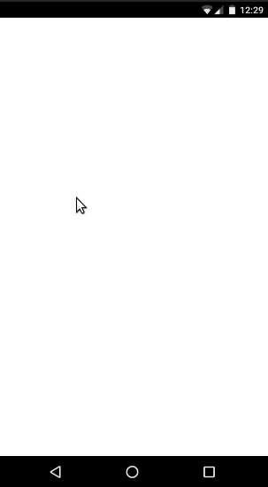

# Curso Ionic 3 para iniciantes

Códigos feitos durante o curso [Ionic 3 para iniciantes](https://www.udemy.com/course/ionic-3-para-iniciantes/) ministrado pelo instrutor [Charles dos Santos França](https://www.udemy.com/user/charles-dos-santos-franca/) na plataforma de cursos online Udemy.